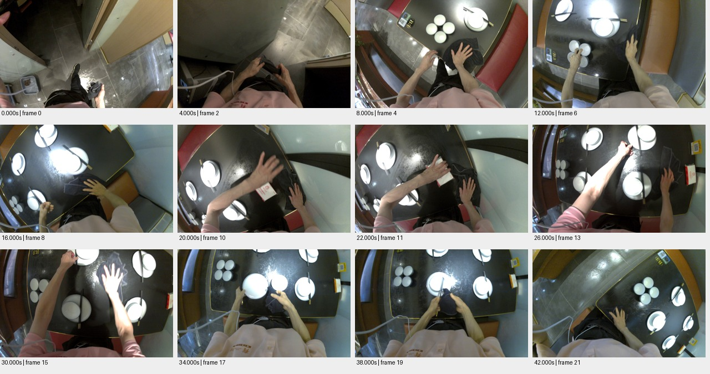

# sample_01_repeat 测试报告

视频：`oss://ccm-ego/scene_example_测试样例/双目餐饮1.03h/cam0.mp4`

实测时长 42.767 秒；分辨率 1920×1200；帧率 30.000。

pipeline 状态：`candidate_semantics`；帧数 22；窗口 2/2 个解析成功。

原始规则初判：**中**，N=11，H=0，复核状态 `candidate`。这些不是已校准真值。

工程检查：动作 11 段；词表合规 11 段；schema齐全 11 段；时间与帧引用合规 11 段；有效动作区间并集覆盖 93.5%。

## 窗口摘要

| 窗口 | 时间/秒 | 模型摘要 |
|---|---|---|
| 1 | 0.000–30.000 | 一个人用抹布擦拭餐桌，整理餐具。 |
| 2 | 32.000–42.000 | 服务员用抹布擦拭餐桌上的碗碟。 |

## 动作候选

| 时间/秒 | 原子动作 | 原始描述 | 对象 | 证据帧/秒 |
|---|---|---|---|---|
| 0.0–4.0 | Move | 人从门口走向餐桌 | 人 | [0.0, 2.0] |
| 4.0–6.0 | Grasp | 人用双手拿起抹布 | 抹布 | [4.0, 6.0] |
| 6.0–10.0 | Place | 人将抹布放在餐桌上 | 抹布 | [6.0, 10.0] |
| 10.0–14.0 | Wipe | 人用抹布擦拭餐桌 | 餐桌 | [10.0, 14.0] |
| 14.0–18.0 | Move | 人移动餐具 | 碗 | [14.0, 18.0] |
| 18.0–22.0 | Wipe | 人用抹布擦拭餐桌 | 餐桌 | [18.0, 22.0] |
| 22.0–26.0 | Move | 人移动餐具 | 盘子 | [22.0, 26.0] |
| 26.0–30.0 | Wipe | 人用抹布擦拭餐桌 | 餐桌 | [26.0, 30.0] |
| 32.0–38.0 | Wipe | 用抹布擦拭碗 | 碗 | [32.0, 34.0, 36.0, 38.0] |
| 38.0–40.0 | Place | 将碗放回原位 | 碗 | [38.0, 40.0] |
| 40.0–42.0 | Wipe | 用抹布擦拭桌面 | 桌子 | [40.0, 42.0] |

## 高难候选

```json
[]
```

## 证据总览



[原始输出](sample_01_repeat.json) · [独立工程核查](sample_01_repeat.checks.json)
