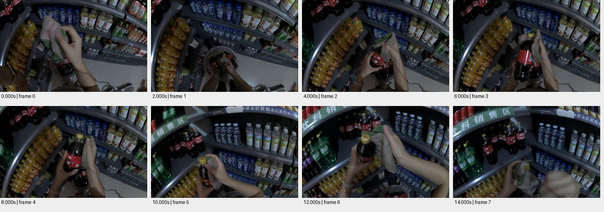

# sample_02 测试报告

视频：`oss://ccm-ego/scene_example_测试样例/双目商超2   2.48h/cam0.mp4`

实测时长 15.233 秒；分辨率 1920×1200；帧率 30.000。

pipeline 状态：`failed`；帧数 0；窗口 0/0 个解析成功。

原始规则初判：**None**，N=None，H=None，复核状态 `None`。这些不是已校准真值。

工程检查：动作 0 段；词表合规 0 段；schema齐全 0 段；时间与帧引用合规 0 段；有效动作区间并集覆盖 0.0%。

## 窗口摘要

| 窗口 | 时间/秒 | 模型摘要 |
|---|---|---|

## 动作候选

| 时间/秒 | 原子动作 | 原始描述 | 对象 | 证据帧/秒 |
|---|---|---|---|---|

## 高难候选

```json
[]
```

## 证据总览



[原始输出](sample_02.json) · [独立工程核查](sample_02.checks.json)

## 独立视觉复核

窗口识别可乐瓶清洁基本正确；objects输出字典导致聚合TypeError；末段Release缺乏支持。

0–14秒持布擦拭可乐瓶，饮料货架与桶可见；12–14秒仍抓持抹布。

| 抽查动作序号（从0开始） | 视觉支持判断 | 理由 | 证据 |
|---|---|---|---|
| 0 | insufficient | 0秒已持有抹布，抽帧不足以证实在0–2秒发生抓起动作。 | [邻帧](../previews/sample_02_action_000.jpg) |
| 2 | supported | 4–8秒双手持瓶和抹布，连续画面支持擦瓶。 | [邻帧](../previews/sample_02_action_002.jpg) |
| 4 | unsupported | 12–14秒仍持抹布擦另一瓶，画面不支持松开抹布。 | [邻帧](../previews/sample_02_action_004.jpg) |

## 失败诊断与已保留的窗口

退出码：1；[运行日志](../logs/sample_02.log)。报告顶部的0帧/0窗口来自失败占位输出，不代表未抽帧。

实际保留 8 帧，1/1 个可解析窗口、5 个原始动作。聚合失败前的模型输出：[窗口原文](sample_02.windows.raw.json)。不能把可用窗口误记为整条管线成功。

- 0.0–14.0秒：一个人在超市饮料区用抹布擦拭可口可乐瓶并将其放回货架。
