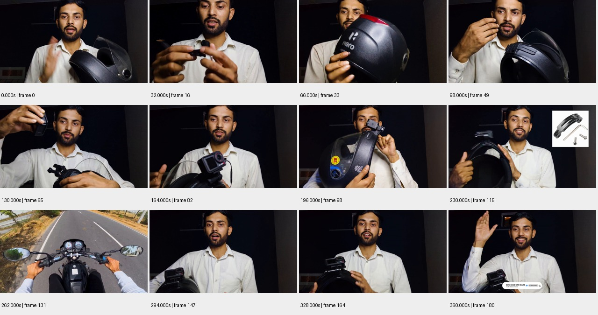

# sample_03 测试报告

视频：`oss://ccm-ego/shushuogushi/cc_20260824_02_simple/nD9JbhaH3eM.mp4`

实测时长 361.367 秒；分辨率 1920×1080；帧率 30.000。

pipeline 状态：`candidate_semantics`；帧数 181；窗口 12/12 个解析成功。

原始规则初判：**中**，N=55，H=0，复核状态 `candidate`。这些不是已校准真值。

工程检查：动作 63 段；词表合规 61 段；schema齐全 63 段；时间与帧引用合规 24 段；有效动作区间并集覆盖 44.6%。

## 窗口摘要

| 窗口 | 时间/秒 | 模型摘要 |
|---|---|---|
| 1 | 0.000–30.000 | 一名男子在黑暗背景下展示并讲解一个头盔下巴支架。 |
| 2 | 32.000–62.000 | 男子在黑暗背景下展示并安装摩托车头盔的配件。 |
| 3 | 64.000–94.000 | 男子在黑暗背景下展示并操作一个黑色摩托车头盔，包括旋转、打开和调整部件。 |
| 4 | 96.000–126.000 | 男子在黑暗背景下展示并操作一个摩托车头盔及其配件。 |
| 5 | 128.000–158.000 | 男子在黑暗背景下安装运动相机到头盔上并进行演示。 |
| 6 | 160.000–190.000 | 男子在室内展示摩托车头盔和运动相机，随后切换到第一人称视角骑行摩托车，最后回到室内继续讲解。 |
| 7 | 192.000–222.000 | 男子演示如何将运动相机安装在摩托车头盔上。 |
| 8 | 224.000–254.000 | 骑摩托车行驶在乡村公路上，中途切换到展示安装在头盔上的运动相机。 |
| 9 | 256.000–286.000 | 第一视角骑行摩托车，随后切换到一名男子手持相机讲解。 |
| 10 | 288.000–318.000 | 一名男子在黑暗背景下对着镜头说话，同时用手势辅助表达。 |
| 11 | 320.000–350.000 | 一名男子手持安装了运动相机的头盔，一边说话一边用手势辅助说明。 |
| 12 | 352.000–360.000 | 一名男子在黑暗背景下手持相机，边说话边做手势，最后挥手告别并展示订阅按钮。 |

## 动作候选

| 时间/秒 | 原子动作 | 原始描述 | 对象 | 证据帧/秒 |
|---|---|---|---|---|
| 0.0–2.0 | Move | 男子挥手并说话 | 男子 | [0.0, 2.0] |
| 2.0–4.0 | Grasp | 男子用双手拿起头盔下巴支架 | 头盔下巴支架 | [2.0, 4.0] |
| 4.0–10.0 | Hold | 男子用右手持头盔下巴支架并展示 | 头盔下巴支架 | [4.0, 10.0] |
| 10.0–14.0 | Release | 男子松开头盔下巴支架 | 头盔下巴支架 | [10.0, 14.0] |
| 14.0–18.0 | Move | 男子用手势继续讲解 | 男子 | [14.0, 18.0] |
| 18.0–22.0 | Move | 男子继续讲解并展示头盔下巴支架 | 头盔下巴支架 | [18.0, 22.0] |
| 22.0–24.0 | Stop | 男子停止动作 | 男子 | [22.0, 24.0] |
| 24.0–30.0 | Grasp | 男子再次拿起头盔下巴支架 | 头盔下巴支架 | [24.0, 30.0] |
| 32.0–38.0 | Attach | 男子将黑色配件安装到头盔上 | 黑色配件 | [32.0, 34.0, 36.0, 38.0] |
| 40.0–44.0 | Attach | 男子将红色胶带贴在黑色配件上 | 红色胶带 | [40.0, 42.0, 44.0] |
| 46.0–52.0 | Attach | 男子将银色配件安装到头盔上 | 银色配件 | [46.0, 48.0, 50.0, 52.0] |
| 54.0–60.0 | Attach | 男子将黑色配件安装到头盔上 | 黑色配件 | [54.0, 56.0, 58.0, 60.0] |
| 64.0–68.0 | Rotate | 男子旋转头盔，展示其正面 | 头盔 | [64.0, 65.0, 66.0, 67.0, 68.0] |
| 68.0–72.0 | Hold | 男子用双手持头盔，展示其侧面 | 头盔 | [68.0, 69.0, 70.0, 71.0, 72.0] |
| 72.0–78.0 | Open | 男子打开头盔的面罩 | 头盔 | [72.0, 73.0, 74.0, 75.0, 76.0, 77.0, 78.0] |
| 78.0–84.0 | Hold | 男子继续持头盔，展示其内部结构 | 头盔 | [78.0, 79.0, 80.0, 81.0, 82.0, 83.0, 84.0] |
| 84.0–88.0 | Rotate | 男子旋转头盔，展示其背面 | 头盔 | [84.0, 85.0, 86.0, 87.0, 88.0] |
| 88.0–94.0 | Touch | 男子用手指触摸头盔的调节部件 | 头盔 | [88.0, 89.0, 90.0, 91.0, 92.0, 93.0, 94.0] |
| 96.0–100.0 | Touch | 男子用手指触摸头盔的部件 | 头盔配件 | [96.0, 97.0, 98.0, 99.0] |
| 100.0–104.0 | Grasp | 男子握住头盔 | 摩托车头盔 | [100.0, 101.0, 102.0, 103.0] |
| 104.0–108.0 | Rotate | 男子旋转头盔展示其侧面 | 摩托车头盔 | [104.0, 105.0, 106.0, 107.0] |
| 108.0–110.0 | Hold | 男子双手持头盔配件 | 头盔配件 | [108.0, 109.0] |
| 110.0–114.0 | Hold | 男子用手指捏住头盔配件 | 头盔配件 | [110.0, 111.0, 112.0, 113.0] |
| 114.0–118.0 | Grasp | 男子用双手握住头盔配件 | 头盔配件 | [114.0, 115.0, 116.0] |
| 118.0–122.0 | Insert | 男子将配件插入头盔 | 头盔配件 | [118.0, 119.0, 120.0, 121.0] |
| 122.0–126.0 | Attach | 男子将配件固定在头盔上 | 头盔配件 | [122.0, 123.0, 124.0, 125.0] |
| 128.0–130.0 | Attach | 将相机支架安装到头盔上 | 相机支架 | [128.0, 129.0] |
| 130.0–132.0 | Attach | 将相机支架固定到头盔上 | 相机支架 | [130.0, 131.0] |
| 132.0–134.0 | Hold | 手持头盔 | 头盔 | [132.0, 133.0] |
| 134.0–136.0 | Grasp | 抓取相机 | 运动相机 | [134.0, 135.0] |
| 136.0–138.0 | Attach | 将相机安装到支架上 | 运动相机 | [136.0, 137.0] |
| 138.0–140.0 | Hold | 手持相机展示 | 运动相机 | [138.0, 139.0] |
| 140.0–142.0 | Hold | 手持相机和头盔 | 运动相机 | [140.0, 141.0] |
| 142.0–144.0 | Grasp | 抓取相机支架 | 相机支架 | [142.0, 143.0] |
| 144.0–146.0 | Attach | 将相机支架安装到头盔上 | 相机支架 | [144.0, 145.0] |
| 146.0–148.0 | Hold | 手持头盔和相机 | 头盔 | [146.0, 147.0] |
| 148.0–150.0 | Move | 移动头盔展示安装位置 | 头盔 | [148.0, 149.0] |
| 150.0–152.0 | Hold | 手持头盔 | 头盔 | [150.0, 151.0] |
| 160.0–165.0 | Hold | 男子手持头盔和运动相机，展示给镜头 | 头盔, 运动相机 | [160.0, 161.0, 162.0, 163.0, 164.0] |
| 166.0–175.0 | Move | 第一人称视角骑行摩托车，双手握把，仪表盘和后视镜可见 | 摩托车 | [166.0, 167.0, 168.0, 169.0, 170.0, 171.0, 172.0, 173.0, 174.0, 175.0] |
| 176.0–190.0 | Hold | 男子再次手持头盔和运动相机，面向镜头讲解 | 头盔, 运动相机 | [176.0, 177.0, 178.0, 179.0, 180.0, 181.0, 182.0, 183.0, 184.0, 185.0, 186.0, 187.0, 188.0, 189.0, 190.0] |
| 192.0–198.0 | Attach | 将相机支架固定在头盔上 | 运动相机 | [192.0, 194.0, 196.0] |
| 198.0–202.0 | Hold | 手持头盔并展示 | 摩托车头盔 | [198.0, 200.0, 202.0] |
| 202.0–206.0 | Move | 移动头盔以展示相机安装位置 | 摩托车头盔 | [202.0, 204.0, 206.0] |
| 206.0–210.0 | Hold | 手持头盔并调整相机角度 | 摩托车头盔 | [206.0, 208.0, 210.0] |
| 210.0–214.0 | Move | 移动头盔以展示相机安装效果 | 摩托车头盔 | [210.0, 212.0, 214.0] |
| 214.0–220.0 | Attach | 再次将相机支架固定在头盔上 | 运动相机 | [214.0, 216.0, 218.0] |
| 220.0–222.0 | Hold | 手持头盔并展示最终安装效果 | 摩托车头盔 | [220.0, 222.0] |
| 224.0–233.0 | Hold | 骑手手持头盔并展示安装在上面的运动相机 | 头盔 | [224.0, 226.0, 228.0, 230.0, 232.0] |
| 234.0–254.0 | Move | 骑手骑着摩托车在公路上行驶 | 摩托车 | [234.0, 236.0, 238.0, 240.0, 242.0, 244.0, 246.0, 248.0, 250.0, 252.0, 254.0] |
| 256.0–265.0 | Move | 骑手骑着摩托车在公路上行驶 | 摩托车 | [256.0, 258.0, 260.0, 262.0, 264.0, 266.0] |
| 266.0–286.0 | Move | 男子在室内移动手部，展示相机 | 男子 | [266.0, 268.0, 270.0, 272.0, 274.0, 276.0, 278.0, 280.0, 282.0, 284.0, 286.0] |
| 288.0–318.0 | Speak | 说话 | 男子 | [288.0, 290.0, 292.0, 294.0, 296.0, 298.0, 300.0, 302.0, 304.0, 306.0, 308.0, 310.0, 312.0, 314.0, 316.0, 318.0] |
| 292.0–318.0 | Gesture | 用手势辅助说话 | 男子 | [292.0, 294.0, 296.0, 298.0, 300.0, 302.0, 304.0, 306.0, 308.0, 310.0, 312.0, 314.0, 316.0, 318.0] |
| 320.0–324.0 | Touch | 用手指触摸头盔边缘 | 头盔 | [320.0, 321.0, 322.0, 323.0] |
| 324.0–330.0 | Move | 手从头盔边缘移开并抬起 | 手 | [324.0, 325.0, 326.0, 327.0, 328.0] |
| 330.0–336.0 | Touch | 手再次触摸头盔 | 头盔 | [330.0, 331.0, 332.0, 333.0, 334.0] |
| 336.0–342.0 | Move | 手从头盔上移开并做出手势 | 手 | [336.0, 337.0, 338.0, 339.0, 340.0] |
| 342.0–350.0 | Move | 手再次靠近头盔并做出手势 | 手 | [342.0, 343.0, 344.0, 345.0, 346.0, 347.0, 348.0, 349.0] |
| 352.0–354.0 | Move | 男子移动右手做手势 | 男子 | [352.0, 353.0, 354.0] |
| 354.0–356.0 | Move | 男子移动右手 | 男子 | [354.0, 355.0, 356.0] |
| 356.0–358.0 | Move | 男子抬起右手 | 男子 | [356.0, 357.0, 358.0] |
| 358.0–360.0 | Move | 男子挥手 | 男子 | [358.0, 359.0, 360.0] |

## 高难候选

```json
[]
```

## 证据总览



[原始输出](sample_03.json) · [独立工程核查](sample_03.checks.json)

## 独立视觉复核

识别头盔相机演示与骑行；出现词表外Speak/Gesture及未抽到的证据时间；N=55混入大量讲解手势。

总览可见室内男子展示头盔/运动相机与公路骑行镜头；抽查的挥手、持相机、告别动作有画面支持，但无音轨核查说话内容。

| 抽查动作序号（从0开始） | 视觉支持判断 | 理由 | 证据 |
|---|---|---|---|
| 0 | partial | 可见手势、张口，Move有支持；静帧不能验证“说话”。 | [邻帧](../previews/sample_03_action_000.jpg) |
| 31 | supported | 138–140秒持续拿着安装到头盔的运动相机展示。 | [邻帧](../previews/sample_03_action_031.jpg) |
| 62 | supported | 358–360秒举手挥动告别。 | [邻帧](../previews/sample_03_action_062.jpg) |
