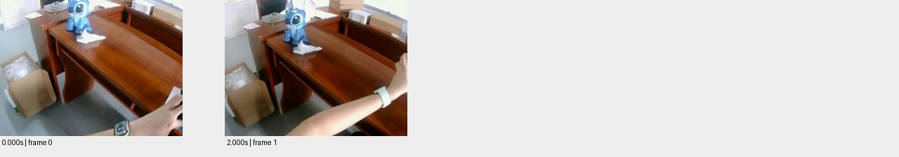

# sample_04 测试报告

视频：`oss://ccm-ego/擎羽/Hugging_face/category__small_object_storage_sorting/task_002__empty_all_sachets_from_box_onto_table/episode_0001_episode_000145_u12_aligned_attempt_clips_20260706_episode_000065/videos/left_cam_left.mp4`

实测时长 4.000 秒；分辨率 640×480；帧率 30.000。

pipeline 状态：`candidate_semantics`；帧数 2；窗口 1/1 个解析成功。

原始规则初判：**低**，N=1，H=0，复核状态 `candidate`。这些不是已校准真值。

工程检查：动作 1 段；词表合规 1 段；schema齐全 1 段；时间与帧引用合规 1 段；有效动作区间并集覆盖 50.0%。

## 窗口摘要

| 窗口 | 时间/秒 | 模型摘要 |
|---|---|---|
| 1 | 0.000–2.000 | 一只手在木桌上操作，旁边有史迪奇玩偶和纸巾。 |

## 动作候选

| 时间/秒 | 原子动作 | 原始描述 | 对象 | 证据帧/秒 |
|---|---|---|---|---|
| 0.0–2.0 | Move | 手从桌子右侧向左移动 | 手 | [0.0, 2.0] |

## 高难候选

```json
[]
```

## 证据总览



[原始输出](sample_04.json) · [独立工程核查](sample_04.checks.json)

## 独立视觉复核

仅2帧，输出泛化的手部Move，未识别标签中的倒袋任务；加密复核仍见操作在画面边缘，不能据自动标签断言模型漏检。

原始文件任务文字：Empty all sachets from box onto table；dense_action为generated状态，非人工真值；这是标签一致性参照，未经专家确认时不当作正式动作/难度真值。

0/2秒手臂移向画面右侧；额外0.5秒间隔复核到3.5秒见右侧盒子被拿起，但没有清楚完整的倾倒过程。参见sample_04_dense_review.jpg。

| 抽查动作序号（从0开始） | 视觉支持判断 | 理由 | 证据 |
|---|---|---|---|
| 0 | partial | 手部移动可见，但“右侧向左”的方向描述与可见手臂向右伸展不一致。 | [邻帧](../previews/sample_04_action_000.jpg) |
