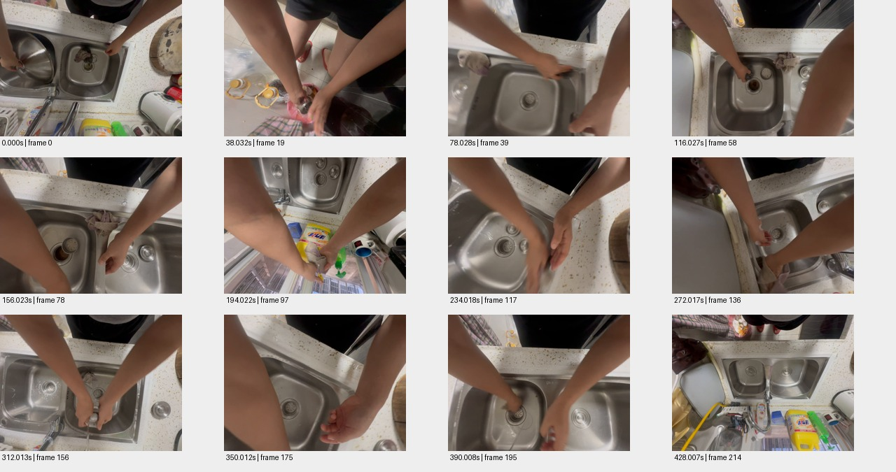

# sample_05_repeat 测试报告

视频：`oss://ccm-ego/补天石ego数据10小时/potentia_10hours_part01/d8jv4tf65vas73e3id80/video.mp4`

实测时长 428.207 秒；分辨率 1920×1440；帧率 30.002。

pipeline 状态：`candidate_semantics`；帧数 215；窗口 14/14 个解析成功。

原始规则初判：**中**，N=63，H=0，复核状态 `candidate`。这些不是已校准真值。

工程检查：动作 90 段；词表合规 90 段；schema齐全 90 段；时间与帧引用合规 44 段；有效动作区间并集覆盖 49.0%。

## 窗口摘要

| 窗口 | 时间/秒 | 模型摘要 |
|---|---|---|
| 1 | 0.000–30.032 | 一个人在厨房水槽中清洗锅盖和清洁海绵。 |
| 2 | 32.032–62.030 | 一个人在厨房水槽中用钢丝球清洁排水口。 |
| 3 | 64.030–94.027 | 一个人在厨房水槽中用钢丝球清洗一个金属容器。 |
| 4 | 96.027–126.025 | 一个人在厨房水槽中用钢丝球清洁排水口。 |
| 5 | 128.025–158.023 | 一个人用钢丝球清洁厨房水槽的排水口。 |
| 6 | 160.023–190.022 | 一个人在厨房水槽中用钢丝球和抹布清洁水槽。 |
| 7 | 192.022–222.018 | 一个人正在用抹布清洗厨房水槽。 |
| 8 | 224.018–254.017 | 一个人用抹布擦拭厨房水槽和水龙头。 |
| 9 | 256.017–286.015 | 一个人在厨房水槽边用抹布清洗水龙头和水槽。 |
| 10 | 288.015–318.013 | 一个人在厨房水槽中清洗排水口盖子和抹布。 |
| 11 | 320.013–350.012 | 一个人在厨房水槽中清洗一块布料。 |
| 12 | 352.010–382.008 | 一个人在厨房水槽中用抹布清洗水槽，然后用清水冲洗抹布。 |
| 13 | 384.008–414.007 | 一个人在厨房水槽中用抹布擦拭水槽和排水口。 |
| 14 | 416.007–428.007 | 一个人在厨房水槽旁用毛巾擦拭水槽边缘。 |

## 动作候选

| 时间/秒 | 原子动作 | 原始描述 | 对象 | 证据帧/秒 |
|---|---|---|---|---|
| 0.0–2.0 | Grasp | 用手握住锅盖 | 锅盖 | [0.0, 1.0] |
| 2.0–6.0 | Lift | 抬起锅盖 | 锅盖 | [2.0, 5.0] |
| 6.0–10.0 | Clean | 用海绵清洗锅盖 | 锅盖 | [6.0, 9.0] |
| 10.0–12.0 | Place | 将锅盖放在灶台上 | 锅盖 | [10.0, 11.0] |
| 12.0–14.0 | Move | 移动到水槽另一侧 | 清洁海绵 | [12.0, 13.0] |
| 14.0–18.0 | Clean | 用海绵清洗水槽 | 水槽 | [14.0, 17.0] |
| 18.0–24.0 | Rub | 用海绵擦拭水槽边缘 | 水槽 | [18.0, 23.0] |
| 24.0–30.0 | Clean | 用海绵清洗水槽排水口 | 水槽 | [24.0, 29.0] |
| 32.032–38.032 | Clean | 用钢丝球清洁排水口 | 排水口 | [32.032, 34.032, 36.032] |
| 38.032–40.03 | Drop | 将钢丝球放入粉色盆中 | 钢丝球 | [38.032] |
| 40.03–42.03 | Clean | 用钢丝球清洁排水口 | 排水口 | [40.03, 42.03] |
| 42.03–44.03 | Clean | 用钢丝球清洁排水口 | 排水口 | [42.03, 44.03] |
| 44.03–46.03 | Clean | 用钢丝球清洁排水口 | 排水口 | [44.03, 46.03] |
| 46.03–48.03 | Clean | 用钢丝球清洁排水口 | 排水口 | [46.03, 48.03] |
| 48.03–50.03 | Clean | 用钢丝球清洁排水口 | 排水口 | [48.03, 50.03] |
| 50.03–52.03 | Clean | 用钢丝球清洁排水口 | 排水口 | [50.03, 52.03] |
| 52.03–54.03 | Clean | 用钢丝球清洁排水口 | 排水口 | [52.03, 54.03] |
| 54.03–56.03 | Clean | 用钢丝球清洁排水口 | 排水口 | [54.03, 56.03] |
| 56.03–58.03 | Clean | 用钢丝球清洁排水口 | 排水口 | [56.03, 58.03] |
| 58.03–62.03 | Clean | 用钢丝球清洁排水口 | 排水口 | [58.03, 60.03, 62.03] |
| 64.03–68.028 | Scrub | 用钢丝球擦拭金属容器 | 金属容器 | [64.03, 65.028, 66.028, 67.028] |
| 68.028–72.028 | Rub | 用钢丝球擦拭水槽内壁 | 水槽 | [68.028, 69.028, 70.028, 71.028] |
| 72.028–76.028 | Hold | 用手握住金属容器 | 金属容器 | [72.028, 73.028, 74.028, 75.028] |
| 76.028–80.028 | Scrub | 用钢丝球擦拭水槽边缘 | 水槽 | [76.028, 77.028, 78.028, 79.028] |
| 80.028–84.028 | Rub | 用钢丝球擦拭水槽内壁 | 水槽 | [80.028, 81.028, 82.028, 83.028] |
| 84.028–88.028 | Scrub | 用钢丝球擦拭金属容器 | 金属容器 | [84.028, 85.028, 86.028, 87.028] |
| 88.028–92.027 | Scrub | 用钢丝球擦拭金属容器 | 金属容器 | [88.028, 89.028, 90.028, 91.028] |
| 92.027–94.027 | Rub | 用钢丝球擦拭水槽内壁 | 水槽 | [92.027, 93.027, 94.027] |
| 96.027–100.027 | Grasp | 双手握住钢丝球 | 钢丝球 | [96.027, 97.027, 98.027, 99.027] |
| 100.027–104.027 | Move | 将钢丝球从台面移到水槽中 | 钢丝球 | [100.027, 101.027, 102.027, 103.027] |
| 104.027–112.027 | Scrub | 用钢丝球擦拭水槽排水口 | 排水口 | [104.027, 105.027, 106.027, 107.027, 108.027, 109.027, 110.027, 111.027] |
| 112.027–114.027 | Hold | 用手握住排水口盖 | 排水口盖 | [112.027, 113.027, 114.027] |
| 114.027–116.027 | Place | 将排水口盖放在水槽边缘 | 排水口盖 | [114.027, 115.027, 116.027] |
| 116.027–126.027 | Scrub | 继续用钢丝球擦拭排水口 | 排水口 | [116.027, 117.027, 118.027, 119.027, 120.027, 121.027, 122.027, 123.027, 124.027, 125.027, 126.027] |
| 128.025–142.025 | Scrub | 用钢丝球擦拭排水口 | 排水口 | [128.025, 130.025, 132.025, 134.025, 136.025, 138.025, 140.025] |
| 142.023–154.023 | Scrub | 继续用钢丝球擦拭排水口 | 排水口 | [142.023, 144.023, 146.023, 148.023, 150.023] |
| 154.023–158.023 | Stop | 停止擦拭 | 排水口 | [154.023, 156.023, 158.023] |
| 160.023–162.023 | Clean | 用钢丝球清洁水槽 | 水槽 | [160.023, 161.023, 162.023] |
| 162.023–164.023 | Move | 将钢丝球移至水槽边缘 | 钢丝球 | [162.023, 163.023, 164.023] |
| 164.023–166.023 | Hold | 用手握住水槽边缘 | 水槽 | [164.023, 165.023, 166.023] |
| 166.023–168.023 | Clean | 用钢丝球清洁水槽 | 水槽 | [166.023, 167.023, 168.023] |
| 168.023–170.022 | Move | 将钢丝球移至水槽边缘 | 钢丝球 | [168.023, 169.023, 170.022] |
| 170.022–172.022 | Clean | 用钢丝球清洁水槽 | 水槽 | [170.022, 171.022, 172.022] |
| 172.022–174.022 | Move | 将钢丝球移至水槽边缘 | 钢丝球 | [172.022, 173.022, 174.022] |
| 174.022–176.022 | Clean | 用钢丝球清洁水槽 | 水槽 | [174.022, 175.022, 176.022] |
| 176.022–178.022 | Move | 将钢丝球移至水槽边缘 | 钢丝球 | [176.022, 177.022, 178.022] |
| 178.022–180.022 | Clean | 用钢丝球清洁水槽 | 水槽 | [178.022, 179.022, 180.022] |
| 180.022–182.022 | Move | 将钢丝球移至水槽边缘 | 钢丝球 | [180.022, 181.022, 182.022] |
| 182.022–184.022 | Clean | 用钢丝球清洁水槽 | 水槽 | [182.022, 183.022, 184.022] |
| 192.022–196.02 | Wipe | 用抹布擦拭水槽 | 水槽 | [192.022, 194.022, 196.02] |
| 198.02–200.02 | Wipe | 用抹布擦拭水槽边缘 | 水槽 | [198.02, 200.02] |
| 202.02–204.02 | Wipe | 用抹布擦拭水槽 | 水槽 | [202.02, 204.02] |
| 206.02–208.02 | Wipe | 用抹布擦拭水槽 | 水槽 | [206.02, 208.02] |
| 210.02–212.02 | Wipe | 用抹布擦拭水槽 | 水槽 | [210.02, 212.02] |
| 214.02–216.02 | Wipe | 用抹布擦拭水槽 | 水槽 | [214.02, 216.02] |
| 218.02–220.02 | Wipe | 用抹布擦拭水槽 | 水槽 | [218.02, 220.02] |
| 222.018–222.018 | Stop | 停止擦拭 | 水槽 | [222.018] |
| 224.018–232.018 | Wipe | 用抹布擦拭水槽边缘 | 水槽 | [224.018, 226.018, 228.018, 230.018, 232.018] |
| 232.018–236.018 | Move | 移动抹布到水龙头 | 抹布 | [232.018, 234.018, 236.018] |
| 238.018–246.018 | Wipe | 用抹布擦拭水龙头 | 水龙头 | [238.018, 240.018, 242.018, 244.018, 246.018] |
| 248.017–254.017 | Wipe | 用抹布擦拭水龙头 | 水龙头 | [248.017, 250.017, 252.017, 254.017] |
| 256.017–260.017 | Rub | 用抹布擦拭水龙头 | 水龙头 | [256.017, 258.017, 260.017] |
| 260.017–264.017 | Rub | 用抹布擦拭水槽 | 水槽 | [260.017, 262.017, 264.017] |
| 264.017–268.017 | Rub | 用抹布擦拭水龙头 | 水龙头 | [264.017, 266.017, 268.017] |
| 268.017–272.015 | Rub | 用抹布擦拭水槽 | 水槽 | [268.017, 270.017, 272.015] |
| 272.015–276.015 | Rub | 用抹布擦拭水槽边缘 | 水槽 | [272.015, 274.015, 276.015] |
| 276.015–280.015 | Rub | 用抹布擦拭水槽边缘 | 水槽 | [276.015, 278.015, 280.015] |
| 280.015–284.015 | Rub | 用抹布擦拭水槽边缘 | 水槽 | [280.015, 282.015, 284.015] |
| 288.015–300.013 | Clean | 用抹布擦拭水槽排水口盖子 | 排水口盖子 | [288.015, 290.015, 292.015, 294.015, 296.015, 298.015, 300.013] |
| 300.013–304.013 | Clean | 用清水冲洗排水口盖子 | 排水口盖子 | [300.013, 302.013, 304.013] |
| 304.013–308.013 | Place | 将排水口盖子放在水槽边 | 排水口盖子 | [304.013, 306.013, 308.013] |
| 308.013–318.013 | Clean | 用清水冲洗抹布 | 抹布 | [308.013, 310.013, 312.013, 314.013, 316.013, 318.013] |
| 320.013–326.012 | Clean | 用双手在水槽中搓洗布料 | 布料 | [320.013, 321.013, 322.013, 323.013, 324.013, 325.013, 326.012] |
| 326.012–330.012 | Rub | 用双手揉搓布料 | 布料 | [326.012, 327.012, 328.012, 329.012, 330.012] |
| 330.012–334.012 | Clean | 在水槽中清洗布料 | 布料 | [330.012, 331.012, 332.012, 333.012, 334.012] |
| 334.012–342.012 | Rub | 用双手揉搓布料 | 布料 | [334.012, 335.012, 336.012, 337.012, 338.012, 339.012, 340.012, 341.012, 342.012] |
| 342.012–348.012 | Clean | 在水槽中清洗布料 | 布料 | [342.012, 343.012, 344.012, 345.012, 346.012, 347.012, 348.012] |
| 348.012–350.012 | Release | 松开布料 | 布料 | [348.012, 349.012, 350.012] |
| 352.01–364.01 | Clean | 用抹布擦拭水槽 | 水槽 | [352.01, 354.01, 356.01, 358.01, 360.01, 362.01, 364.01] |
| 366.01–370.01 | Place | 将水槽盖放入右侧水槽 | 水槽盖 | [366.01, 368.01, 370.01] |
| 372.01–378.008 | Wipe | 用抹布擦拭水槽 | 水槽 | [372.01, 374.01, 376.01, 378.008] |
| 380.008–382.008 | Wipe | 用抹布擦拭水龙头 | 水龙头 | [380.008, 382.008] |
| 384.008–398.008 | Clean | 用抹布擦拭水槽和排水口 | 水槽 | [384.008, 386.008, 388.008, 390.008, 392.008, 394.008, 396.008, 398.008] |
| 400.008–402.008 | Wipe | 用抹布擦拭水槽边缘 | 水槽 | [400.008, 402.008] |
| 404.007–414.007 | Clean | 用抹布擦拭水槽和排水口 | 水槽 | [404.007, 406.007, 408.007, 410.007, 412.007, 414.007] |
| 416.007–418.007 | Wipe | 用毛巾擦拭水槽边缘 | 水槽 | [416.007, 417.007, 418.007] |
| 418.007–420.007 | Wipe | 继续用毛巾擦拭水槽边缘 | 水槽 | [418.007, 419.007, 420.007] |
| 420.007–422.007 | Wipe | 用毛巾擦拭水槽边缘 | 水槽 | [420.007, 421.007, 422.007] |
| 422.007–424.007 | Wipe | 用毛巾擦拭水槽边缘 | 水槽 | [422.007, 423.007, 424.007] |
| 424.007–426.007 | Wipe | 用毛巾擦拭水槽边缘 | 水槽 | [424.007, 425.007, 426.007] |

## 高难候选

```json
[]
```

## 证据总览



[原始输出](sample_05_repeat.json) · [独立工程核查](sample_05_repeat.checks.json)
