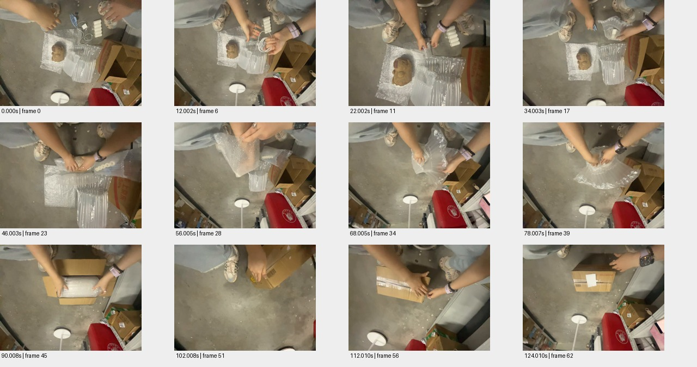

# sample_06 测试报告

视频：`oss://ccm-ego/补天石ego数据10小时/potentia_10hours_part02/d8b4jo765vas73fkfocg/video.mp4`

实测时长 124.527 秒；分辨率 1920×1440；帧率 59.995。

pipeline 状态：`candidate_semantics`；帧数 63；窗口 4/4 个解析成功。

原始规则初判：**中**，N=23，H=0，复核状态 `candidate`。这些不是已校准真值。

工程检查：动作 30 段；词表合规 30 段；schema齐全 30 段；时间与帧引用合规 23 段；有效动作区间并集覆盖 70.7%。

## 窗口摘要

| 窗口 | 时间/秒 | 模型摘要 |
|---|---|---|
| 1 | 0.000–30.003 | 两人在地面上整理和包装物品，包括一个毛绒玩具、气泡膜和充电线。 |
| 2 | 32.003–62.005 | 两人正在用气泡膜包装一个毛绒玩具，过程中有调整和整理动作。 |
| 3 | 64.005–94.008 | 一个人正在拆开一个用气泡膜包裹的物品并将其放入纸箱中。 |
| 4 | 96.008–124.010 | 一个人正在用透明胶带封箱，然后将箱子放在地上。 |

## 动作候选

| 时间/秒 | 原子动作 | 原始描述 | 对象 | 证据帧/秒 |
|---|---|---|---|---|
| 0.0–4.0 | Grasp | 双手抓取充电线 | 充电线 | [0.0, 2.0, 4.0] |
| 4.0–12.0 | Wrap | 用气泡膜包裹充电线 | 充电线 | [4.0, 6.0, 8.0, 10.0, 12.0] |
| 12.0–18.0 | Place | 将包裹好的充电线放在地上 | 充电线 | [12.0, 14.0, 16.0, 18.0] |
| 18.0–28.0 | Wrap | 用气泡膜包裹毛绒玩具 | 毛绒玩具 | [18.0, 20.0, 22.0, 24.0, 26.0, 28.0] |
| 28.0–30.0 | Place | 将包裹好的毛绒玩具放在气泡膜上 | 毛绒玩具 | [28.0, 30.0] |
| 32.003–34.003 | Grasp | 双手抓取气泡膜包裹物 | 气泡膜 | [32.003] |
| 34.003–36.003 | Wrap | 用气泡膜包裹毛绒玩具 | 毛绒玩具 | [34.003] |
| 36.003–40.003 | Wrap | 继续用气泡膜包裹毛绒玩具 | 毛绒玩具 | [36.003] |
| 40.003–42.003 | Wrap | 用气泡膜包裹毛绒玩具 | 毛绒玩具 | [40.003] |
| 42.003–44.003 | Wrap | 用气泡膜包裹毛绒玩具 | 毛绒玩具 | [42.003] |
| 44.003–46.003 | Wrap | 用气泡膜包裹毛绒玩具 | 毛绒玩具 | [44.003] |
| 46.003–48.003 | Wrap | 用气泡膜包裹毛绒玩具 | 毛绒玩具 | [46.003] |
| 48.003–50.005 | Wrap | 用气泡膜包裹毛绒玩具 | 毛绒玩具 | [48.003] |
| 50.005–52.005 | Lift | 提起包裹好的毛绒玩具 | 毛绒玩具 | [50.005] |
| 52.005–54.005 | Place | 将包裹好的毛绒玩具放在气柱袋上 | 气柱袋 | [52.005] |
| 54.005–56.005 | Wrap | 用气泡膜包裹毛绒玩具 | 毛绒玩具 | [54.005] |
| 56.005–60.005 | Wrap | 用气泡膜包裹毛绒玩具 | 毛绒玩具 | [56.005] |
| 64.005–70.007 | Grasp | 双手抓住气泡膜 | 气泡膜 | [64.005, 66.005, 68.005, 70.007] |
| 70.007–76.007 | Lift | 抬起气泡膜 | 气泡膜 | [70.007, 72.007, 74.007, 76.007] |
| 76.007–80.007 | Lower | 放下气泡膜 | 气泡膜 | [76.007, 78.007, 80.007] |
| 80.007–84.007 | Grasp | 双手抓住纸箱 | 纸箱 | [80.007, 82.007, 84.007] |
| 84.007–90.008 | Place | 将气泡膜放入纸箱 | 纸箱 | [84.007, 86.007, 88.007, 90.008] |
| 90.008–94.008 | Close | 合上纸箱 | 纸箱 | [90.008, 92.008, 94.008] |
| 96.008–100.008 | Grasp | 双手抓住纸箱 | 纸箱 | [96.008, 97.008, 98.008, 99.008] |
| 100.008–104.008 | Grasp | 用手指捏住胶带 | 胶带 | [100.008, 101.008, 102.008, 103.008] |
| 104.008–110.008 | Wrap | 用胶带缠绕纸箱 | 纸箱 | [104.008, 105.008, 106.008, 107.008, 108.008, 109.008] |
| 110.008–114.008 | Press | 按压胶带使其粘牢 | 胶带 | [110.008, 111.008, 112.008, 113.008] |
| 114.008–118.008 | Place | 将纸箱放在地上 | 纸箱 | [114.008, 115.008, 116.008, 117.008] |
| 118.008–120.008 | Grasp | 双手抓住纸箱 | 纸箱 | [118.008, 119.008] |
| 120.008–124.008 | Place | 将纸箱放在地上 | 纸箱 | [120.008, 121.008, 122.008, 123.008] |

## 高难候选

```json
[]
```

## 证据总览



[原始输出](sample_06.json) · [独立工程核查](sample_06.checks.json)

## 独立视觉复核

识别整理→包裹→装箱→封箱；第三窗却描述为拆开包装，和整体包裹过程冲突；物品被称毛绒玩具尚不能确认。

原始文件任务文字：物流快递 / 包裹封箱与打包；这是标签一致性参照，未经专家确认时不当作正式动作/难度真值。

总览显示充电线等物品整理、包气泡膜及气柱袋、装纸箱、贴胶带封箱；棕色物体可见但材料类别不清。

| 抽查动作序号（从0开始） | 视觉支持判断 | 理由 | 证据 |
|---|---|---|---|
| 0 | supported | 2–4秒双手接触并拿起盘绕的白色充电线。 | [邻帧](../previews/sample_06_action_000.jpg) |
| 15 | partial | 54–56秒继续包覆物品有支持，但仅凭画面无法确认内部是毛绒玩具。 | [邻帧](../previews/sample_06_action_015.jpg) |
| 29 | supported | 120–124秒转动纸箱后放回地面。 | [邻帧](../previews/sample_06_action_029.jpg) |
