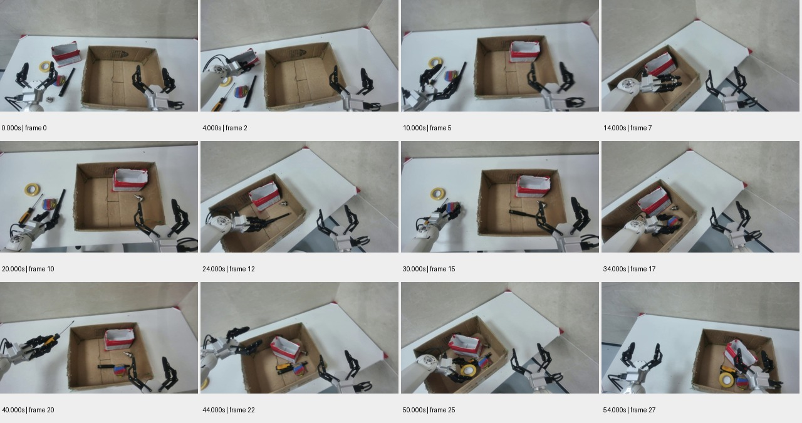

# sample_07_repeat 测试报告

视频：`oss://ccm-ego/astribot/sample_data/家具-打包装箱/videos/chunk-000/observation.images.head_camera/episode_000003.mp4`

实测时长 54.667 秒；分辨率 1280×720；帧率 30.000。

pipeline 状态：`candidate_semantics`；帧数 28；窗口 2/2 个解析成功。

原始规则初判：**中**，N=13，H=0，复核状态 `candidate`。这些不是已校准真值。

工程检查：动作 13 段；词表合规 13 段；schema齐全 13 段；时间与帧引用合规 13 段；有效动作区间并集覆盖 87.8%。

## 窗口摘要

| 窗口 | 时间/秒 | 模型摘要 |
|---|---|---|
| 1 | 0.000–30.000 | 两个机械臂在白色桌面上协作，将散落的物品放入一个纸箱中。 |
| 2 | 32.000–54.000 | 机器人手臂依次拾取并放入不同工具到纸箱中。 |

## 动作候选

| 时间/秒 | 原子动作 | 原始描述 | 对象 | 证据帧/秒 |
|---|---|---|---|---|
| 0.0–4.0 | Grasp | 机械臂1抓取红色盒子 | 红色盒子 | [0.0, 2.0, 4.0] |
| 4.0–8.0 | Place | 机械臂1将红色盒子放入纸箱 | 红色盒子 | [4.0, 6.0, 8.0] |
| 8.0–12.0 | Grasp | 机械臂1抓取金属小零件 | 金属小零件 | [8.0, 10.0, 12.0] |
| 12.0–16.0 | Place | 机械臂1将金属小零件放入纸箱 | 金属小零件 | [12.0, 14.0, 16.0] |
| 16.0–20.0 | Grasp | 机械臂1抓取黑色笔状物 | 黑色笔状物 | [16.0, 18.0, 20.0] |
| 20.0–24.0 | Place | 机械臂1将黑色笔状物放入纸箱 | 黑色笔状物 | [20.0, 22.0, 24.0] |
| 24.0–28.0 | Grasp | 机械臂1抓取彩色橡皮擦 | 彩色橡皮擦 | [24.0, 26.0, 28.0] |
| 28.0–30.0 | Place | 机械臂1将彩色橡皮擦放入纸箱 | 彩色橡皮擦 | [28.0, 30.0] |
| 32.0–34.0 | Place | 将彩色物体放入纸箱 | 彩色物体 | [32.0, 34.0] |
| 36.0–40.0 | Pick | 拾取螺丝刀 | 螺丝刀 | [36.0, 40.0] |
| 40.0–44.0 | Place | 将螺丝刀放入纸箱 | 螺丝刀 | [40.0, 44.0] |
| 46.0–50.0 | Pick | 拾取胶带 | 胶带 | [46.0, 50.0] |
| 50.0–54.0 | Place | 将胶带放入纸箱 | 胶带 | [50.0, 54.0] |

## 高难候选

```json
[]
```

## 证据总览



[原始输出](sample_07_repeat.json) · [独立工程核查](sample_07_repeat.checks.json)
