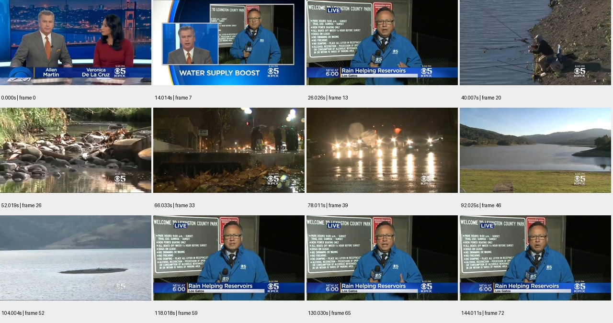

# sample_08 测试报告

视频：`oss://ccm-ego/youtube/-fI-ogq9OC8.mp4`

实测时长 145.846 秒；分辨率 640×360；帧率 29.970。

pipeline 状态：`candidate_semantics`；帧数 73；窗口 5/5 个解析成功。

原始规则初判：**中**，N=18，H=0，复核状态 `candidate`。这些不是已校准真值。

工程检查：动作 28 段；词表合规 28 段；schema齐全 28 段；时间与帧引用合规 27 段；有效动作区间并集覆盖 79.5%。

## 窗口摘要

| 窗口 | 时间/秒 | 模型摘要 |
|---|---|---|
| 1 | 0.000–30.030 | 新闻主播介绍水供应增加的新闻，随后切换到现场记者报道降雨帮助水库蓄水的情况。 |
| 2 | 32.032–62.029 | 新闻报道展示雨水补给水库的情况，包括记者现场报道、钓鱼者垂钓、专家访谈以及水库和河流的自然景观。 |
| 3 | 64.031–94.027 | 雨夜城市街道与水库水位变化的对比报道。 |
| 4 | 96.029–126.026 | 视频展示了水库的自然风光，随后转为新闻记者在公园现场报道降雨对水库的补给作用。 |
| 5 | 128.028–144.011 | 新闻记者在夜晚的公园入口处报道降雨对水库的补给作用。 |

## 动作候选

| 时间/秒 | 原子动作 | 原始描述 | 对象 | 证据帧/秒 |
|---|---|---|---|---|
| 0.0–2.002 | others | 新闻主播和女主持人在演播室对话 | Allen Martin, Veronica De La Cruz | [0.0, 2.002] |
| 2.002–12.012 | others | 画面切换到水坝航拍，主播在演播室继续报道 | Allen Martin | [2.002, 12.012] |
| 12.012–18.018 | others | 画面切换到现场记者，主播在演播室继续报道 | Allen Martin | [12.012, 18.018] |
| 18.018–30.03 | others | 现场记者Len Ramirez在公园标志牌前报道降雨帮助水库蓄水 | Len Ramirez | [18.018, 30.03] |
| 32.032–34.001 | others | 镜头从记者切换到水库全景，阳光照射水面 | 水库 | [32.032, 34.001] |
| 34.001–38.005 | others | 镜头从水库全景切换到钓鱼者在岸边垂钓 | 钓鱼者 | [34.001, 38.005] |
| 38.005–42.009 | others | 镜头从钓鱼者切换到专家接受采访 | 专家 | [38.005, 42.009] |
| 42.009–50.017 | others | 专家继续接受采访，背景为干涸河床 | 专家 | [42.009, 50.017] |
| 50.017–54.021 | others | 镜头切换到河流中漂浮的树枝和岩石 | 河流 | [50.017, 54.021] |
| 54.021–58.025 | others | 镜头切换到水库全景，阳光照射水面 | 水库 | [54.021, 58.025] |
| 58.025–62.029 | others | 专家继续接受采访，背景为干涸河床 | 专家 | [58.025, 62.029] |
| 64.031–68.001 | Move | 行人和自行车在雨中移动 | 行人, 自行车 | [64.031, 66.033, 68.001] |
| 70.003–72.005 | Move | 汽车在雨中行驶 | 汽车 | [70.003, 72.005] |
| 72.005–74.007 | Move | 行人撑伞过马路 | 行人 | [72.005, 74.007] |
| 74.007–78.011 | Wait | 记者与采访者在雨中等待 | 记者, 采访者 | [74.007, 76.009, 78.011] |
| 78.013–80.015 | Move | 车辆在湿滑路面上行驶 | 车辆 | [78.013, 80.015] |
| 80.015–82.015 | Move | 镜头从水库全景切换到水位图 | 水库, 水位图 | [80.015, 82.015] |
| 82.017–84.017 | Identify | 显示水库水位图 | 水位图 | [82.017, 84.017] |
| 84.019–86.019 | Identify | 显示水库水位图 | 水位图 | [84.019, 86.019] |
| 86.021–88.021 | Identify | 显示水库水位图 | 水位图 | [86.021, 88.021] |
| 88.023–90.025 | Identify | 显示水库水位图 | 水位图 | [88.023, 90.025] |
| 90.025–92.025 | Identify | 显示水库水位图 | 水位图 | [90.025, 92.025] |
| 92.027–94.027 | Move | 镜头从水库全景切换到水库岸边 | 水库 | [92.027, 94.027] |
| 96.029–98.031 | Move | 镜头从岸边树木向水面平移 | 镜头 | [96.029, 98.031] |
| 100.033–104.004 | Move | 镜头从岸边钓鱼者平移到远处小岛 | 镜头 | [100.033, 104.004] |
| 104.006–118.018 | Move | 镜头从远处小岛拉近并转向野餐桌 | 镜头 | [104.006, 118.018] |
| 118.018–126.026 | Wait | 新闻记者站立并讲话 | 新闻记者 | [118.018, 126.026] |
| 128.028–144.011 | Hold | 记者手持麦克风并讲话 | 麦克风 | [128.028, 129.028, 130.03, 131.032, 132.032, 133.001, 134.003, 135.005, 136.007, 137.009, 138.011, 139.013, 140.015, 141.017, 142.019, 143.021] |

## 高难候选

```json
[]
```

## 证据总览



[原始输出](sample_08.json) · [独立工程核查](sample_08.checks.json)

## 独立视觉复核

抽到新闻视频，仍输出中难/N=18；缺少非操作视频过滤；采访被写成等待，证据引用也有虚构时间。

新闻字幕和镜头支持雨水补给水库报道主题；74–76秒为持麦采访，78秒已切交通画面。该视频不构成连续ego操作任务。

| 抽查动作序号（从0开始） | 视觉支持判断 | 理由 | 证据 |
|---|---|---|---|
| 0 | partial | 字幕支持主持人身份且可见演播室，但静帧未验证两人对话。 | [邻帧](../previews/sample_08_action_000.jpg) |
| 14 | unsupported | 74–76秒可见持麦采访，78秒已切道路车辆，不支持整段在雨中等待。 | [邻帧](../previews/sample_08_action_014.jpg) |
| 27 | partial | 持麦克风可见，讲话音轨未核查；语音内容不能从抽帧确证。 | [邻帧](../previews/sample_08_action_027.jpg) |
