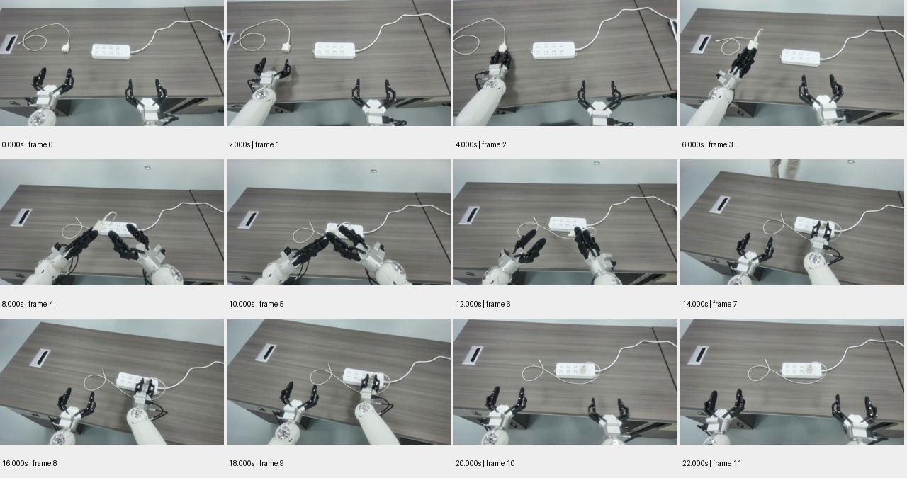

# sample_09 测试报告

视频：`oss://ccm-ego/astribot/sample_data/家具-插充电器/videos/chunk-000/observation.images.head_camera/episode_000001.mp4`

实测时长 22.033 秒；分辨率 1280×720；帧率 30.000。

pipeline 状态：`candidate_semantics`；帧数 12；窗口 1/1 个解析成功。

原始规则初判：**中**，N=4，H=0，复核状态 `candidate`。这些不是已校准真值。

工程检查：动作 5 段；词表合规 5 段；schema齐全 5 段；时间与帧引用合规 5 段；有效动作区间并集覆盖 90.8%。

## 窗口摘要

| 窗口 | 时间/秒 | 模型摘要 |
|---|---|---|
| 1 | 0.000–22.000 | 两个机械臂协作将电源插头插入插座。 |

## 动作候选

| 时间/秒 | 原子动作 | 原始描述 | 对象 | 证据帧/秒 |
|---|---|---|---|---|
| 0.0–4.0 | Grasp | 机械臂1抓取电源插头 | 电源插头 | [0.0, 2.0, 4.0] |
| 4.0–8.0 | Move | 机械臂1移动插头靠近插座 | 电源插头 | [4.0, 6.0, 8.0] |
| 8.0–10.0 | Insert | 机械臂1将插头插入插座 | 电源插座 | [8.0, 10.0] |
| 10.0–14.0 | Release | 机械臂1松开插头 | 电源插头 | [10.0, 12.0, 14.0] |
| 14.0–20.0 | Wait | 机械臂1和机械臂2等待 | 机械臂1, 机械臂2 | [14.0, 16.0, 18.0, 20.0] |

## 高难候选

```json
[]
```

## 证据总览



[原始输出](sample_09.json) · [独立工程核查](sample_09.checks.json)

## 独立视觉复核

插充电器主题正确；把8–10秒两臂交接误写成已插入，把后续靠近/插入及收回过程写成等待。

原始文件任务文字：插充电器；拿起插头，插入插座；这是标签一致性参照，未经专家确认时不当作正式动作/难度真值。

0–6秒左夹爪取插头，8–12秒两臂交接，14–18秒右爪在排插处操作，20秒已放开。

| 抽查动作序号（从0开始） | 视觉支持判断 | 理由 | 证据 |
|---|---|---|---|
| 0 | supported | 0–4秒左爪接近抓住插头，6秒已经举起。 | [邻帧](../previews/sample_09_action_000.jpg) |
| 2 | unsupported | 8–10秒插头还在两爪之间交接，尚未位于排插插孔中；把交接写成插入。 | [邻帧](../previews/sample_09_action_002.jpg) |
| 4 | unsupported | 14–20秒右爪在排插处完成操作并撤回，不是两臂持续等待。 | [邻帧](../previews/sample_09_action_004.jpg) |
