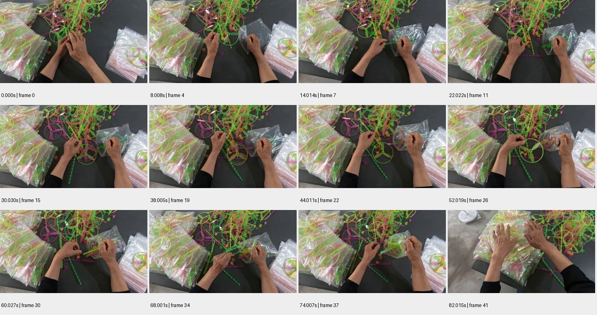

# sample_10 测试报告

视频：`oss://ccm-ego/Deepreach/dr-egoview-teaser-slam/clips/aec5beea-3f7e-4a2c-b623-2e2e0eb2b730_grp002_p01of01/source.mp4`

实测时长 82.416 秒；分辨率 1920×1080；帧率 29.970。

pipeline 状态：`candidate_semantics`；帧数 42；窗口 3/3 个解析成功。

原始规则初判：**中**，N=26，H=0，复核状态 `candidate`。这些不是已校准真值。

工程检查：动作 26 段；词表合规 26 段；schema齐全 26 段；时间与帧引用合规 25 段；有效动作区间并集覆盖 65.5%。

## 窗口摘要

| 窗口 | 时间/秒 | 模型摘要 |
|---|---|---|
| 1 | 0.000–30.030 | 一个人正在将彩色塑料玩具放入透明塑料袋中。 |
| 2 | 32.032–62.029 | 一个人正在将彩色塑料玩具部件放入透明塑料袋中。 |
| 3 | 64.031–82.015 | 一个人正在将彩色塑料玩具装入透明塑料袋中。 |

## 动作候选

| 时间/秒 | 原子动作 | 原始描述 | 对象 | 证据帧/秒 |
|---|---|---|---|---|
| 0.0–2.002 | Grasp | 双手抓取一个透明塑料袋 | 透明塑料袋 | [0.0, 2.002] |
| 2.002–4.004 | Place | 将塑料袋放在桌面上 | 透明塑料袋 | [2.002, 4.004] |
| 4.004–6.006 | Grasp | 双手抓取一个彩色塑料玩具 | 彩色塑料玩具 | [4.004, 6.006] |
| 6.006–8.008 | Place | 将彩色塑料玩具放入塑料袋中 | 透明塑料袋 | [6.006, 8.008] |
| 8.008–10.01 | Grasp | 双手抓取另一个彩色塑料玩具 | 彩色塑料玩具 | [8.008, 10.01] |
| 10.01–12.012 | Place | 将彩色塑料玩具放入塑料袋中 | 透明塑料袋 | [10.01, 12.012] |
| 12.012–14.014 | Grasp | 双手抓取另一个彩色塑料玩具 | 彩色塑料玩具 | [12.012, 14.014] |
| 14.014–16.016 | Place | 将彩色塑料玩具放入塑料袋中 | 透明塑料袋 | [14.014, 16.016] |
| 16.016–18.018 | Grasp | 双手抓取另一个彩色塑料玩具 | 彩色塑料玩具 | [16.016, 18.018] |
| 18.018–20.02 | Place | 将彩色塑料玩具放入塑料袋中 | 透明塑料袋 | [18.018, 20.02] |
| 20.02–22.022 | Grasp | 双手抓取另一个彩色塑料玩具 | 彩色塑料玩具 | [20.02, 22.022] |
| 22.022–24.024 | Place | 将彩色塑料玩具放入塑料袋中 | 透明塑料袋 | [22.022, 24.024] |
| 32.032–34.001 | Grasp | 双手抓取一个彩色塑料玩具部件 | 彩色塑料玩具部件 | [32.032] |
| 34.001–36.003 | Place | 将玩具部件放入透明塑料袋中 | 透明塑料袋 | [34.001] |
| 36.003–38.005 | Grasp | 双手抓取另一个彩色塑料玩具部件 | 彩色塑料玩具部件 | [36.003] |
| 38.005–40.007 | Place | 将玩具部件放入透明塑料袋中 | 透明塑料袋 | [38.005] |
| 40.007–42.009 | Grasp | 双手抓取另一个彩色塑料玩具部件 | 彩色塑料玩具部件 | [40.007] |
| 42.009–44.011 | Place | 将玩具部件放入透明塑料袋中 | 透明塑料袋 | [42.009] |
| 44.011–46.013 | Grasp | 双手抓取另一个彩色塑料玩具部件 | 彩色塑料玩具部件 | [44.011] |
| 46.013–48.015 | Place | 将玩具部件放入透明塑料袋中 | 透明塑料袋 | [46.013] |
| 48.015–50.017 | Grasp | 双手抓取另一个彩色塑料玩具部件 | 彩色塑料玩具部件 | [48.015] |
| 50.017–52.019 | Place | 将玩具部件放入透明塑料袋中 | 透明塑料袋 | [50.017] |
| 52.019–54.021 | Grasp | 双手抓取另一个彩色塑料玩具部件 | 彩色塑料玩具部件 | [52.019] |
| 54.021–56.023 | Place | 将玩具部件放入透明塑料袋中 | 透明塑料袋 | [54.021] |
| 64.031–75.009 | Place | 将彩色塑料玩具放入透明塑料袋中 | 彩色塑料玩具 | [64.031, 66.033, 68.001, 70.003, 72.005, 74.007, 76.009] |
| 76.009–82.015 | Place | 将装满玩具的塑料袋放在桌子上 | 透明塑料袋 | [76.009, 78.011, 80.013, 82.015] |

## 高难候选

```json
[]
```

## 证据总览



[原始输出](sample_10.json) · [独立工程核查](sample_10.checks.json)

## 独立视觉复核

识别彩色塑料部件装袋，和源任务包装目标一致；未细分扇叶/手柄，部分Place时点证据不足；N=26。

原始文件任务文字：Select a fan blade and handle from the bulk parts, then pack them into a clear ziplock bag to complete the packaging.；这是标签一致性参照，未经专家确认时不当作正式动作/难度真值。

总览为从混合塑料部件中选取零件并装透明袋，最后将袋子放到已包装品上；选取与入袋动作在2秒抽帧下可能混淆。

| 抽查动作序号（从0开始） | 视觉支持判断 | 理由 | 证据 |
|---|---|---|---|
| 0 | supported | 2秒双手在右侧袋堆处抓持并分离透明袋。 | [邻帧](../previews/sample_10_action_000.jpg) |
| 13 | insufficient | 34–36秒主要可见左手持零件、右手持袋，未清楚显示入袋状态改变，不能确认所称Place。 | [邻帧](../previews/sample_10_action_013.jpg) |
| 25 | supported | 76–82秒将装好部件的袋子移到左侧成品堆并放下。 | [邻帧](../previews/sample_10_action_025.jpg) |
